# SAE 401 GR06 Treesushi :   Gestion des commandes d'un restaurant de sushi.

### Membres du projet : FAUPIN Rémi, MAREGA Erwan, MERLETTI Sacha, SANGARE Darryl

### Nom du Groupe : Treesushi
### Date de lancement : 13/02/2024 
### Date de fin : 23/03/2024

 

### Note Erwan 
Suite à un incident sur GitHub, une personne s'est connectée à son compte à partir de mon ordinateur. Après m'être déconnecté de son compte, chaque fois que j'ai réalisé des commits sur notre projet, ceux-ci sont attribués au nom de cette personne, bien que son compte ne soit plus actif sur mon ordinateur. Il est important de souligner que les commits en question sont bien les miens. Merci pour votre compréhension à cette situation.
Cordialement,
Erwan Marega

## Table des matières

- [Livrable L401_1 : Dossier d'analyse ](#Livrable1)
- [Usage](#usage)
- [Contributing](#contributing)
- [License](#license)
- [Contact](#contact)

##  Livrable L401_1 : Dossier d'analyse 

Une description détaillée du projet. Qu'est-ce que c'est, pourquoi a-t-il été créé, quel problème résout-il ?

## Sommaire

### 1) [Planification du projet (Trello)](#part1)
### 2) [Répartition des tâches](#2)
### 3) [Nom et logo de l'application](#3)
### 4) [Analyse des besoins de l'application : diagramme de 'UseCase'](#4)
### 5) [Diagramme d'activité pour présenter les différentes étapes du projet](#5)
### 6) [Diagramme de classes](#6)
### 7) [Architecture fonctionnelle de l'application](#7)

 

##  1) Planification du projet (Trello)
Vous pouvez acceder au Trello en cliquant
[ici.](https://trello.com/invite/b/A61L0Obt/ATTIc4d0fbb85a7947163a4c3d79316ec2521B6CE55F/sae-401-gr06-treeshushi)

 

##  2) Répartition des tâches
**A) Rémi FAUPIN :**
- Chef de projet : Dossier d'analyse, RGPD, user story, test unitaire
 - Front-End : Angular, HTML, CSS, Tailwind (Reproduction de la maquette en code)
 - Graphisme : Maquette

 

**B) Erwan Marega :**
- Graphisme : Logo, Maquette, Charte Graphique
- Back-End : API
- Front-End : Angular, HTML, CSS, Tailwind (Reproduction de la maquette en code + Fonctionnalité Local Storage)

 

**C) Sacha Merletti :**
- Back-End : API
- Graphiqme : Maquette
- Projet : Diagramme Use Case et diagramme de classe

 

**D) Darryl Sangare :**
- Front-End : Angular, HTML, CSS, Tailwind (Reproduction de la maquette)
- Graphisme : Maquette 
- Projet : Diagramme d'activité et architecture fonctionnelle de l'application

 

##  3) Nom et logo de l'application

### Nom de l'application :  
 ### Treesushi
 

### Logo de l'application :
| Logo version 1 | Logo version 2 | Logo version 3 |
| --------- | --------- |  --------- |
|  | | |

##  4) Analyse des besoins de l'application :   Diagramme de 'Use Case'

 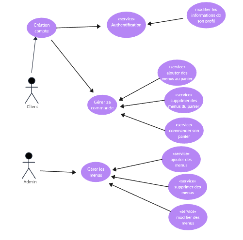

##  5) Diagramme d'activité 
 

##  6) Diagramme de classe
 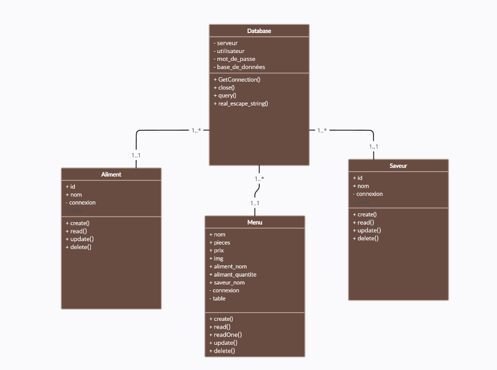

##  7) Architecture fonctionnelle de l'application

 

## Maquette du site web

 

 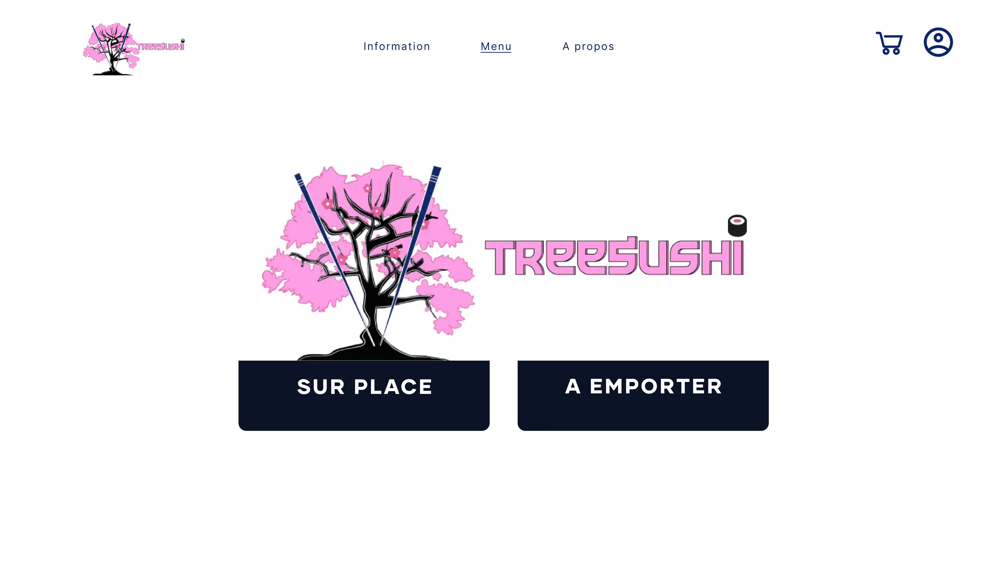
 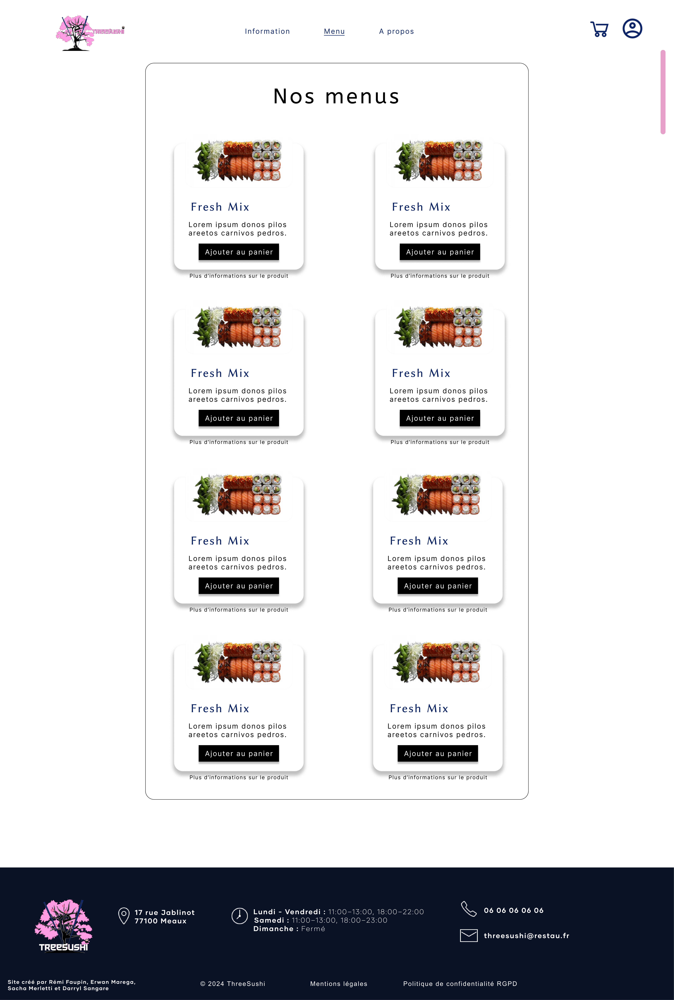
 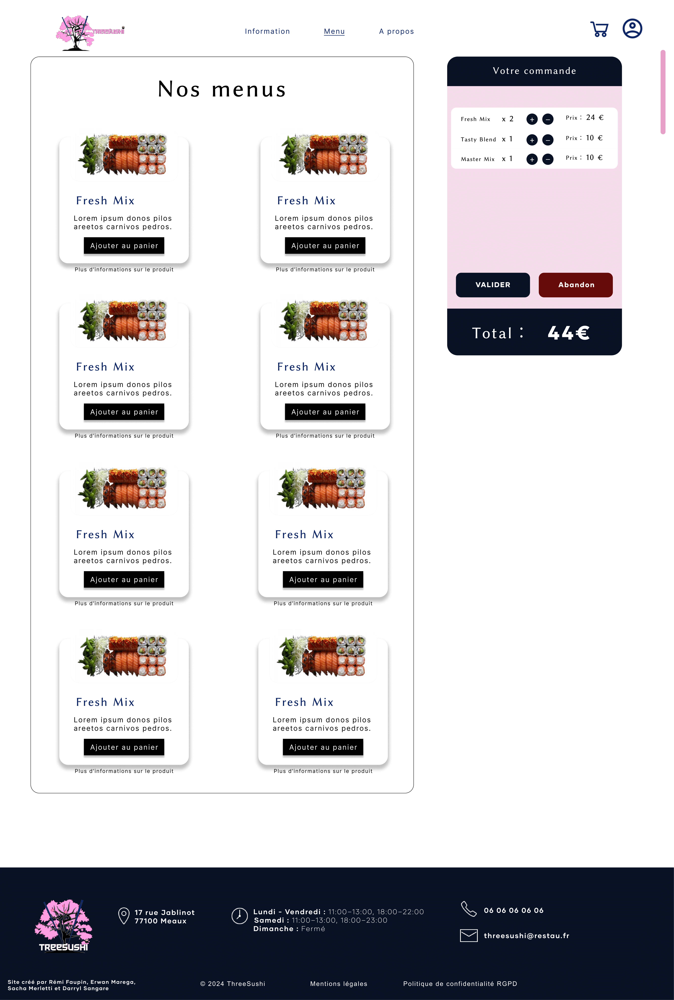
 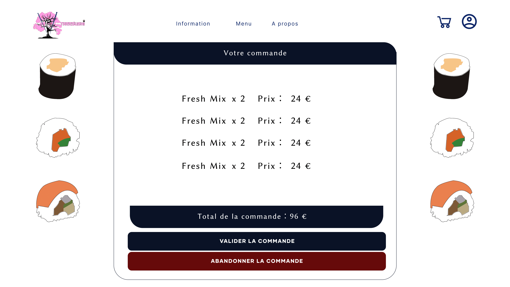
 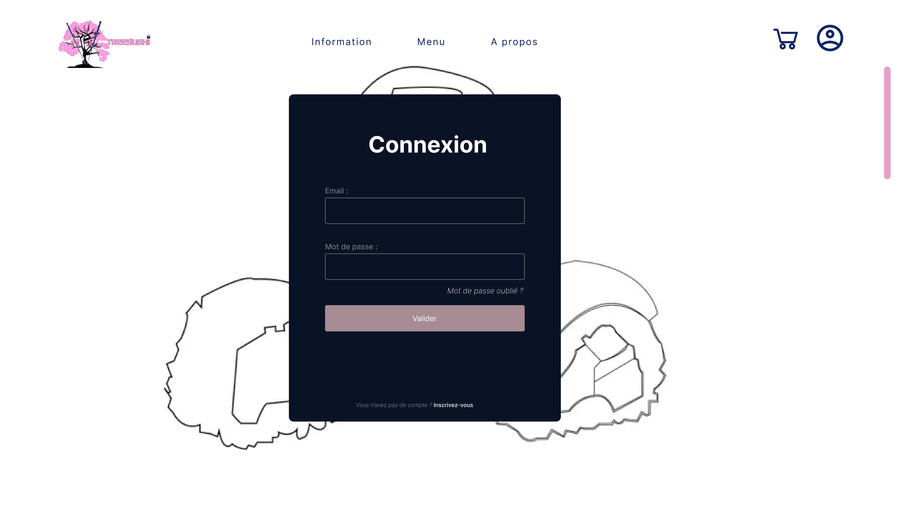
 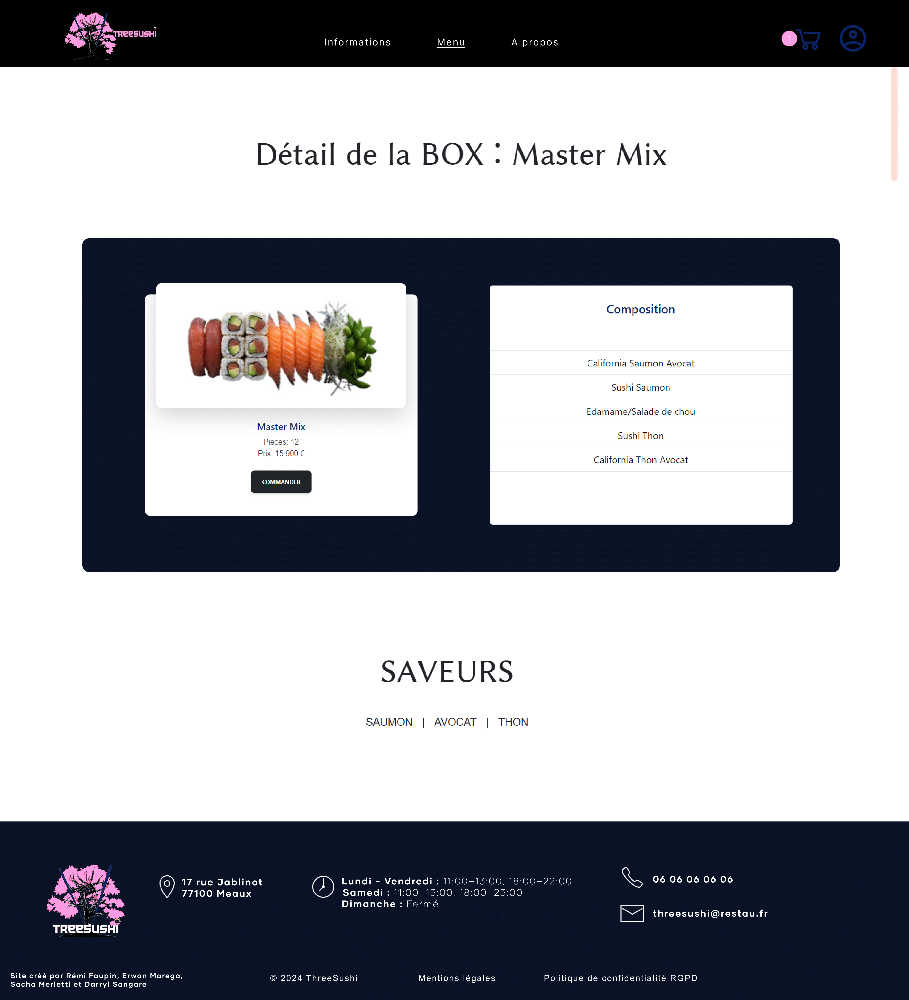
 
 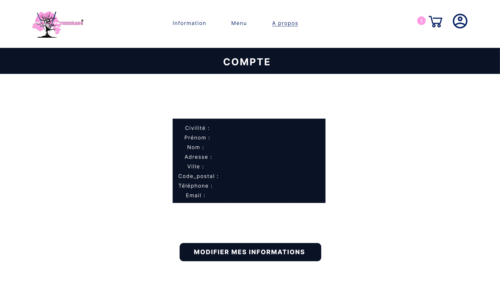
 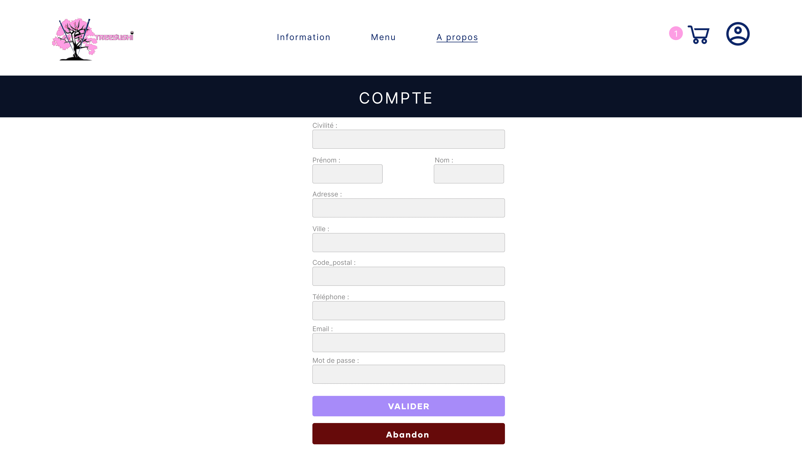
 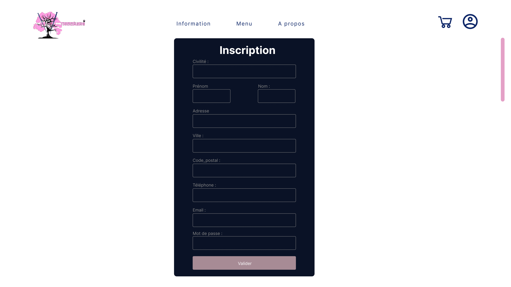
 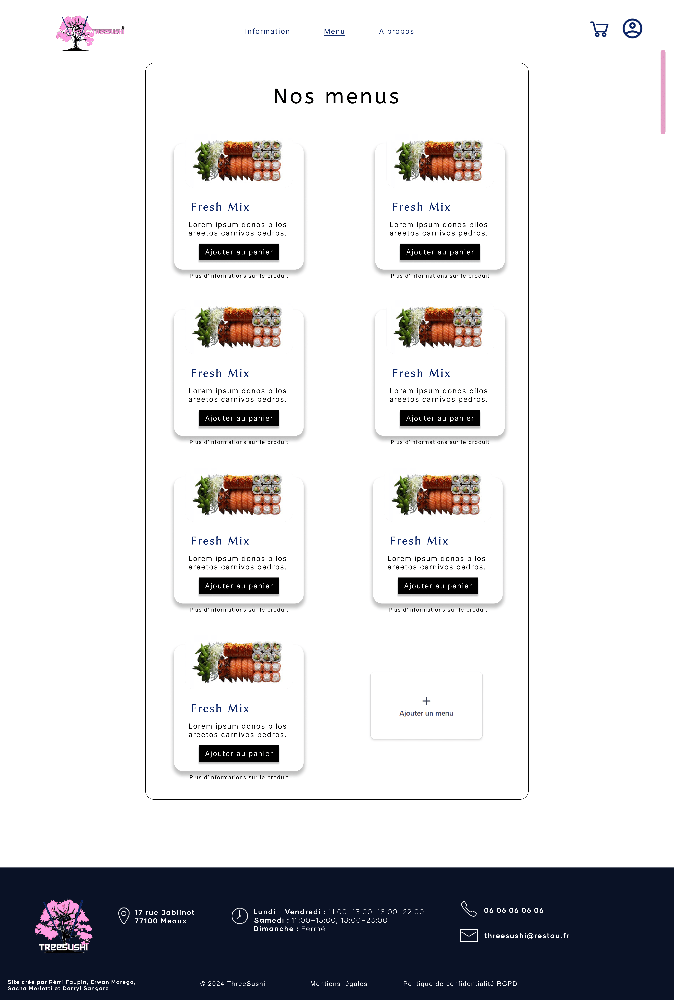
 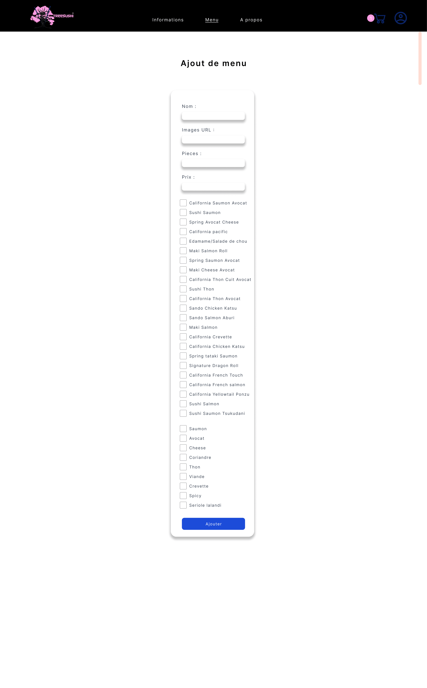
 

